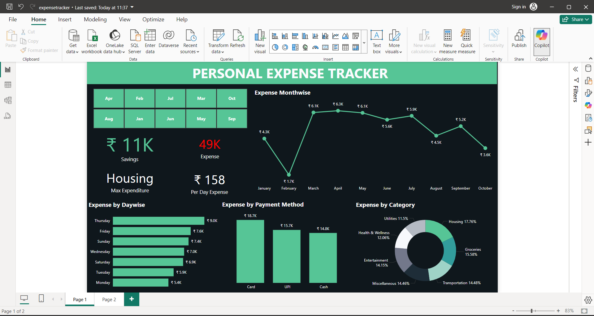

# Personal Expense Tracker Project
## Overview
### The Personal Expense Tracker is a Python-based project designed to help users log and analyze daily expenses.Users input details like the amount, category, payment type, and description for each expense. All entries are stored in a CSV file (tracker.csv), which acts as a database. A Power BI dashboard is also included to visualize spending trends and offer insights into spending habits.

## Key Features
### Expense Logging in Python
- The program prompts users to input daily expenses.
- Expense categories: Housing, Utilities, Groceries, Transportation, Entertainment, Health & Wellness, and Miscellaneous.
- Payment methods: Cash, UPI, and Card.
- Users can add descriptions for context.
- Data is saved in tracker.csv with columns for date, amount, payment method, category, and description.
## CSV Storage
- Expenses are stored in a CSV file for easy access and data management.
- This file serves as a database for users to review and analyze their expenses further.
## Data Visualization with Power BI
### Visualizations created from tracker.csv in Power BI provide insights:
- Monthly Expense Trends: Line chart of monthly expense patterns.
- Savings vs. Expense Summary: Overview of total savings and spending.
- Top Spending Categories: Donut chart categorizing expenses to identify major spending areas.
- Daywise Spending: Bar chart showing daily spending habits.
- Payment Method Breakdown: Bar chart displaying expenses by payment method (Cash, UPI, Card).

## User-Friendly Interface
- Interactive prompts guide users through the expense entry, with straightforward options for categories and payment methods.
## How to Use
1. Run the Python script to input expense details.
2. Follow prompts to categorize expenses and select a payment method.
3. Open the Power BI dashboard to analyze spending trends, track monthly expenditures, and view spending breakdowns by category and payment method.